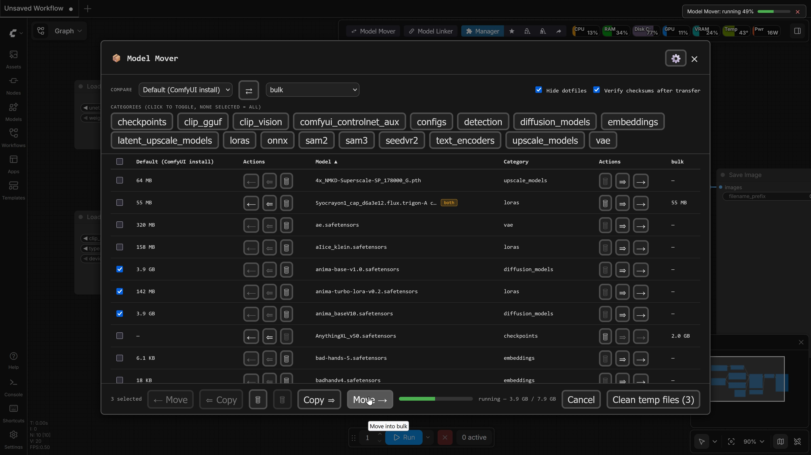
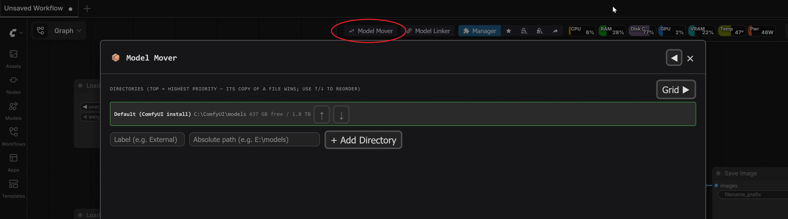
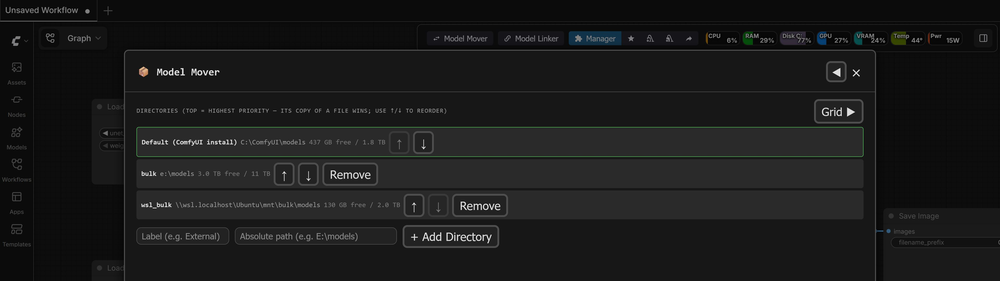
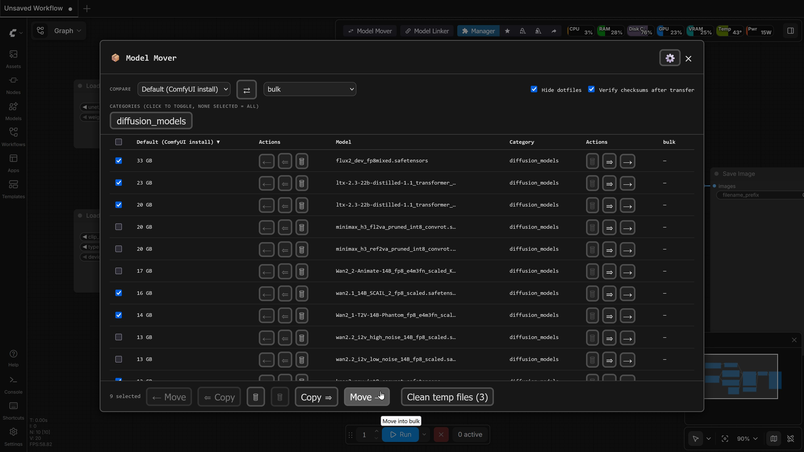

# ComfyUI-Model-Mover

A [Steam Mover](https://www.traynier.com/software/steammover)-inspired GUI built into ComfyUI for shuffling model weights between two or more storage locations... for example, your fast primary drive and a larger backup drive — without hand-editing `extra_model_paths.yaml` or breaking any workflow that references those files.



## Why not symlinks/junction points?

ComfyUI already supports multiple model locations. Model Mover gives fine-grained control over which files live where without sacrificing convenience. You can back up your entire collection on an external drive while cherry-picking specific favorites for duplication on fast internal storage — all without reorganizing model folder hierarchies or manually editing YAML configuration files.

## Features

- **Intuitive grid layout:** Pick any two registered directories as columns, compare model locations and file sizes side by side, and move or copy in either direction with confirmation prompts and batch support. Directory management stays in its own tab (⚙ in the header) so the grid gets maximum screen real estate.
- **Copy, not just Move:** Keep a full mirror on a backup drive while choosing which models stay resident on fast storage. Copy leaves the source untouched and is visually distinct (double arrow + accent color) from Move.
- **Safe transfers:** Every cross-drive operation writes to a `.part` temporary file, hashes, and verifies against the source before removing original files when moving. Transfer status remains visible even if you close the main dialog.
- **Priority control:** When the same model exists in multiple directories, choose which copy ComfyUI loads first, with `both` badges indicating duplicates.
- **Basic cleanup:** Detects and offers to clear interrupted or incomplete download files left behind by tools like Hugging Face Hub, `curl`/`wget`, `aria2c`, or browsers.

## Installation

### Option 1: ComfyUI Manager
Search for **ComfyUI-Model-Mover** in ComfyUI Manager and click **Install**.

### Option 2: Manual Installation
1. Clone or download this repository into your `ComfyUI/custom_nodes/` directory:
   ```bash
   cd ComfyUI/custom_nodes
   git clone https://github.com/FNGarvin/ComfyUI-Model-Mover.git
   ```
2. Install the single dependency (`ruamel.yaml`) into ComfyUI's Python environment:
   - **Standard / Portable / Venv:**
     ```bash
     path/to/comfyui/python -m pip install -r requirements.txt
     ```
   - **If using `uv`:**
     ```bash
     uv pip install --python path/to/comfyui/python -r requirements.txt
     ```
3. Restart ComfyUI. A **Model Mover** button will appear in the top menu bar (or floating menu button on legacy frontend versions).

## Usage

1. Click the **Model Mover** button in the ComfyUI header bar. If fewer than two directories are registered, it opens to the **Directories** tab (also accessible via the ⚙ header button).

   

2. Register your model locations (label + absolute path), e.g., `E:\models`. Subfolders are automatically mapped to model categories.

   

3. Switch to the main grid (⚙ becomes a back arrow while on the Directories tab) and select two directories to compare in the header controls.
4. Select model categories using the filter chips, sort by file size or name to easily find large files and free up disk space, and perform individual or batch **Move** and **Copy** operations.

   

## Troubleshooting

- **"ruamel.yaml is not installed"** — Ensure `requirements.txt` was installed into ComfyUI's specific Python environment rather than system Python, then restart ComfyUI.
- **A model doesn't show up after adding a directory** — The grid re-scans automatically on directory changes. If node dropdowns in ComfyUI still show old paths, use ComfyUI's **Refresh** command or reload the browser page.
- **Move/Copy buttons are disabled for an entry** — The entry is a symlink or hard link (marked with a `linked` badge). Model Mover skips automated transfer of linked files to prevent link corruption (see `ROADMAP.md`).

## Project Layout

- `core/` — Backend logic: directory discovery, scanning, `extra_model_paths.yaml` configuration updates, file transfer execution (`mover.py`), and API endpoints (`routes.py`).
- `web/model_mover.js` — Frontend UI, toolbar integration, dialog layout, and grid state management.
- `tests/` & `TESTING.md` — Test suite and manual verification checklist.

## License

MIT — see [LICENSE](LICENSE).
